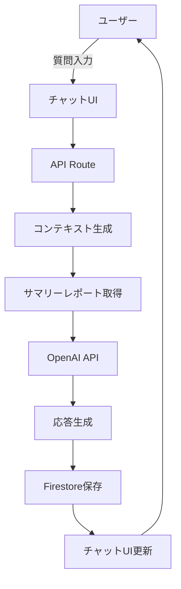

# 感性 AI Marketer 開発計画

## 1. プロジェクト概要

### 目的
テーマごとのサマリーレポートの結果を基に、AI（GPT）とチャット形式でマーケティング戦略やビジネス洞察についてディスカッションができる機能を実装する。

### 主要機能
- サマリーレポートの内容を理解したAIアシスタント
- リアルタイムチャット機能
- マーケティング戦略の提案
- 行動経済学・心理学的観点からの分析
- ペルソナ別の詳細分析
- 競合分析と差別化戦略の提案

## 2. システムアーキテクチャ

### 技術スタック
```
フロントエンド:
- Next.js 14 (App Router)
- TypeScript
- React Context (状態管理)
- ReactMarkdown (マークダウン表示)
- Tailwind CSS (スタイリング)

バックエンド:
- Next.js API Routes
- OpenAI API (GPT-4/GPT-3.5)
- Firebase Firestore (データ永続化)
- Server-Sent Events (リアルタイム通信)

データ処理:
- サマリーレポートのコンテキスト化
- チャット履歴の管理
- セッション管理
```

## 3. データフロー設計



### データモデル

#### ChatSession (Firestore)
```typescript
interface ChatSession {
  sessionId: string;
  themeId: string;
  userId: string;
  createdAt: Timestamp;
  updatedAt: Timestamp;
  metadata: {
    themeName: string;
    totalInterviews: number;
    reportSummary: string; // サマリーレポートの要約
  };
}
```

#### ChatMessage (Firestore)
```typescript
interface ChatMessage {
  messageId: string;
  sessionId: string;
  text: string;
  sender: 'user' | 'ai';
  timestamp: Timestamp;
  metadata?: {
    tokens?: number;
    model?: string;
    context?: string[];
  };
}
```

## 4. 実装フェーズ

### Phase 1: 基盤構築（基本機能）
**期間: 2-3日**

#### タスク:
1. **APIエンドポイント作成**
   - `/api/ai-marketer/chat` - チャットメッセージ処理
   - `/api/ai-marketer/session` - セッション管理
   - `/api/ai-marketer/context` - コンテキスト生成

2. **データベース設計**
   - Firestoreコレクション構造の実装
   - チャット履歴の保存・取得

3. **基本的なチャットUI**
   - メッセージ送受信機能
   - リアルタイム更新
   - マークダウン表示

### Phase 2: AI機能強化
**期間: 2-3日**

#### タスク:
1. **コンテキスト管理**
   - サマリーレポートの要約と埋め込み
   - 関連性の高い情報の抽出
   - チャット履歴のコンテキスト化

2. **プロンプトエンジニアリング**
   - マーケティング専門家としてのペルソナ設定
   - 行動経済学・心理学の知識ベース
   - 具体的な提案生成のテンプレート

3. **応答品質向上**
   - 構造化された回答フォーマット
   - データ可視化の提案
   - アクションアイテムの生成

### Phase 3: ユーザー体験向上
**期間: 1-2日**

#### タスク:
1. **UIの改善**
   - タイピングインジケーター
   - 提案されたトピックのクイックアクセス
   - チャット履歴の検索機能

2. **パフォーマンス最適化**
   - レスポンスのストリーミング
   - メッセージのページネーション
   - キャッシング戦略

3. **エラーハンドリング**
   - API制限の管理
   - 再試行ロジック
   - ユーザーフレンドリーなエラーメッセージ

## 5. 主要コンポーネント設計

### 5.1 AI Marketer Chat API
```typescript
// /api/ai-marketer/chat/route.tsx
interface ChatRequest {
  sessionId: string;
  themeId: string;
  message: string;
  userId: string;
}

interface ChatResponse {
  messageId: string;
  response: string;
  suggestions?: string[]; // 次の質問の提案
  references?: Reference[]; // 参照したデータ
}
```

### 5.2 Context Generator
```typescript
// /lib/ai-marketer/context-generator.ts
class ContextGenerator {
  async generateContext(themeId: string): Promise<AIContext> {
    // サマリーレポートの取得
    // 重要な洞察の抽出
    // ペルソナ情報の整理
    // 統計データの準備
  }
}
```

### 5.3 Chat UI Component
```typescript
// /components/ai-marketer/ChatInterface.tsx
interface ChatInterfaceProps {
  theme: Theme;
  sessionId?: string;
}

const ChatInterface: React.FC<ChatInterfaceProps> = ({ theme, sessionId }) => {
  // チャット履歴の管理
  // メッセージ送受信
  // リアルタイム更新
  // UI状態管理
}
```

## 6. プロンプト設計

### システムプロンプト例
```
あなたは「感性 AI Marketer」として、インタビュー結果の分析を基にマーケティング戦略を提案する専門家です。

【あなたの役割】
1. 行動経済学と心理学の観点から消費者行動を分析
2. データに基づいた具体的な提案
3. ペルソナごとの詳細な戦略立案
4. 競合分析と差別化ポイントの明確化

【利用可能なデータ】
- サマリーレポート: [要約内容]
- 総インタビュー数: [数値]
- 主要ペルソナ: [リスト]
- キーワード頻度: [統計]

【回答形式】
- 構造化されたマークダウン形式
- 具体的な数値とデータの引用
- アクションアイテムの明示
- 視覚的に分かりやすい構成
```

## 7. セキュリティとパフォーマンス

### セキュリティ対策
- APIキーの環境変数管理
- レート制限の実装
- ユーザー認証の確認
- データアクセス権限の検証

### パフォーマンス最適化
- レスポンスのストリーミング (SSE)
- インメモリキャッシング
- データベースクエリの最適化
- CDNの活用

## 8. テスト計画

### 単体テスト
- API エンドポイント
- コンテキスト生成ロジック
- データ変換処理

### 統合テスト
- エンドツーエンドのチャットフロー
- データベース連携
- エラーシナリオ

### ユーザビリティテスト
- 応答速度
- UI/UXの使いやすさ
- エラーメッセージの分かりやすさ

## 9. 成功指標（KPI）

1. **応答品質**
   - 関連性スコア: 90%以上
   - ユーザー満足度: 4.5/5.0以上

2. **パフォーマンス**
   - 平均応答時間: 3秒以内
   - エラー率: 1%未満

3. **利用率**
   - アクティブセッション数
   - 平均会話長
   - リピート利用率

## 10. 今後の拡張機能

### 将来的な機能追加
1. **音声入力対応**
2. **多言語サポート**
3. **レポート自動生成**
4. **データビジュアライゼーション統合**
5. **チーム共有機能**
6. **カスタムAIモデルの学習**

## 11. リスクと対策

### 技術的リスク
- **OpenAI API の制限**: キャッシング戦略とフォールバック実装
- **コンテキスト長の制限**: 効率的な要約アルゴリズム
- **リアルタイム性能**: WebSocketやSSEの活用

### ビジネスリスク
- **コスト管理**: 使用量モニタリングと制限設定
- **データプライバシー**: 厳格なアクセス制御
- **品質保証**: 継続的なモニタリングとフィードバック収集

## 実装優先順位

1. **必須機能（MVP）**
   - 基本的なチャット機能
   - サマリーレポートとの連携
   - 簡単な質問応答

2. **重要機能**
   - 高度なコンテキスト理解
   - 構造化された提案生成
   - チャット履歴の永続化

3. **追加機能**
   - 提案のエクスポート
   - チーム共有
   - カスタマイズ可能なAI設定