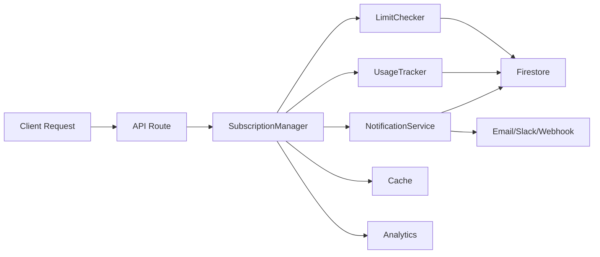

# 改善されたサブスクリプションシステム ガイド

## 目次
1. [概要](#概要)
2. [主な改善点](#主な改善点)
3. [アーキテクチャ](#アーキテクチャ)
4. [実装ガイド](#実装ガイド)
5. [管理者向け機能](#管理者向け機能)
6. [API リファレンス](#api-リファレンス)
7. [設定と拡張](#設定と拡張)
8. [ベストプラクティス](#ベストプラクティス)

## 概要

改善されたサブスクリプションシステムは、より扱いやすく、拡張性の高い設計に進化しました。主要な改善点として、統合マネージャーによる一元管理、リアルタイム通知システム、動的プラン設定、カスタムルールエンジンなどが実装されています。

### システムの特徴

- **統合管理**: `SubscriptionManager`による一元的な制限管理
- **柔軟な通知**: メール、Slack、Webhook、アプリ内通知に対応
- **動的設定**: Firestoreベースの動的プラン管理
- **高度な監視**: 使用量の急増検知と予測アラート
- **カスタマイズ可能**: 組織ごとのカスタムルール設定
- **管理者ツール**: 包括的な管理APIとダッシュボード機能

## 主な改善点

### 1. 統合SubscriptionManager

以前は分散していた機能を統合：

```typescript
// 旧システム
const limitChecker = new LimitChecker();
const usageTracker = new UsageTracker();
const canUse = await limitChecker.canUse(orgId, 'interviews');
await usageTracker.incrementUsage(orgId, 'interviews');

// 新システム
const manager = new SubscriptionManager();
const result = await manager.canUseFeature(orgId, 'interviews', {
  notifyOnLimit: true,
  customRules: customRules
});
if (result.allowed) {
  await manager.recordUsage(orgId, 'interviews');
}
```

### 2. 高度な通知システム

多チャンネル対応の通知：

```typescript
// 通知設定
const config: NotificationConfig = {
  enabled: true,
  channels: [
    { type: 'email', enabled: true },
    { type: 'slack', enabled: true },
    { type: 'webhook', enabled: true },
    { type: 'in-app', enabled: true }
  ],
  thresholds: [50, 80, 90, 100],
  recipients: [
    { type: 'role', value: 'admin' },
    { type: 'email', value: 'alert@example.com' }
  ],
  slackWebhookUrl: 'https://hooks.slack.com/...',
  webhookUrl: 'https://api.example.com/alerts'
};
```

### 3. カスタムルールエンジン

組織固有の制限を設定：

```typescript
// 時間ベースのルール
const timeRule: CustomRule = {
  id: 'business-hours-only',
  name: '営業時間内のみ',
  type: 'time_based',
  active: true,
  priority: 10,
  config: {
    blockedHours: [0, 1, 2, 3, 4, 5, 22, 23], // 22時-6時はブロック
    timezone: 'Asia/Tokyo'
  },
  appliesTo: ['interviews', 'reports']
};

// レート制限ルール
const rateRule: CustomRule = {
  id: 'api-rate-limit',
  name: 'API呼び出し制限',
  type: 'rate_limit',
  active: true,
  priority: 5,
  config: {
    maxRequests: 100,
    timeWindow: 3600, // 1時間
    burstLimit: 20
  },
  appliesTo: ['api_calls']
};
```

## アーキテクチャ

### コンポーネント構成

```
src/
├── lib/
│   └── subscription/
│       ├── subscription-manager.ts    # 統合マネージャー
│       ├── notification-service.ts    # 通知サービス
│       ├── limit-checker.ts          # 制限チェック（既存）
│       ├── usage-tracker.ts          # 使用量追跡（既存）
│       └── helpers.ts                # ヘルパー関数
├── app/
│   └── api/
│       ├── admin/
│       │   └── subscription/
│       │       └── route.tsx         # 管理者API
│       └── create_interview/
│           ├── route.tsx              # 既存API
│           └── route_v2.tsx          # 改善版API
└── types/
    └── subscription.ts                # 型定義（拡張済み）
```

### データフロー



## 実装ガイド

### 基本的な使用方法

#### 1. 機能の使用可否チェック

```typescript
import { SubscriptionManager } from '@/lib/subscription/subscription-manager';

const manager = new SubscriptionManager();

// シンプルなチェック
const result = await manager.canUseFeature(
  organizationId,
  'interviews'
);

if (!result.allowed) {
  return {
    error: result.reason,
    suggestions: result.suggestions
  };
}

// 高度なチェック（カスタムルール付き）
const advancedResult = await manager.canUseFeature(
  organizationId,
  'interviews',
  {
    amount: 1,
    checkConcurrent: true,
    notifyOnLimit: true,
    customRules: await getCustomRules(organizationId)
  }
);
```

#### 2. 使用量の記録

```typescript
// 通常の使用量記録
await manager.recordUsage(
  organizationId,
  'interviews',
  1,
  {
    metadata: {
      interviewId: 'int_123',
      userId: 'user_456',
      timestamp: new Date()
    }
  }
);

// 同時実行数の記録
await manager.recordUsage(
  organizationId,
  'concurrent_interviews',
  1,
  { concurrent: true }
);

// 同時実行数の解放
await manager.releaseUsage(
  organizationId,
  'concurrent_interviews'
);
```

#### 3. 使用統計の取得

```typescript
// 基本統計
const stats = await manager.getUsageStats(organizationId);

// 履歴付き統計
const detailedStats = await manager.getUsageStats(
  organizationId,
  {
    includeHistory: true,
    dateRange: {
      start: new Date('2024-01-01'),
      end: new Date('2024-12-31')
    }
  }
);

console.log({
  プラン: stats.planName,
  使用率: stats.percentages,
  次回リセット: stats.nextReset,
  アラート: stats.alerts
});
```

### APIルートでの実装例

```typescript
// src/app/api/your-feature/route.tsx
import { NextResponse } from 'next/server';
import { SubscriptionManager } from '@/lib/subscription/subscription-manager';

const manager = new SubscriptionManager();

export async function POST(request: Request) {
  try {
    const { userId, featureType } = await request.json();
    const organizationId = await getOrganizationId(userId);
    
    // 制限チェック
    const checkResult = await manager.canUseFeature(
      organizationId,
      featureType,
      { notifyOnLimit: true }
    );
    
    if (!checkResult.allowed) {
      return NextResponse.json({
        error: 'limit_exceeded',
        message: checkResult.reason,
        usage: checkResult.usage,
        suggestions: checkResult.suggestions
      }, { status: 429 });
    }
    
    // 機能を実行
    const result = await executeFeature();
    
    // 使用量を記録
    await manager.recordUsage(organizationId, featureType);
    
    return NextResponse.json({
      success: true,
      result,
      usage: checkResult.usage
    });
    
  } catch (error) {
    // エラーハンドリング
    return NextResponse.json(
      { error: 'Internal server error' },
      { status: 500 }
    );
  }
}
```

## 管理者向け機能

### 管理者API エンドポイント

#### 使用統計の取得

```bash
GET /api/admin/subscription?action=stats&organizationId=org_123
```

#### 全組織の概要（スーパー管理者のみ）

```bash
GET /api/admin/subscription?action=all-organizations
```

#### プラン変更

```javascript
POST /api/admin/subscription
{
  "action": "change-plan",
  "organizationId": "org_123",
  "newPlanId": "prod_pro",
  "immediate": true,
  "resetUsage": false,
  "notifyUsers": true
}
```

#### カスタムルールの追加

```javascript
POST /api/admin/subscription
{
  "action": "add-custom-rule",
  "organizationId": "org_123",
  "rule": {
    "id": "weekend-unlimited",
    "name": "週末無制限",
    "type": "time_based",
    "active": true,
    "priority": 10,
    "config": {
      "blockedDays": ["monday", "tuesday", "wednesday", "thursday", "friday"]
    },
    "appliesTo": ["interviews"]
  }
}
```

#### プラン制限の更新（スーパー管理者のみ）

```javascript
PUT /api/admin/subscription
{
  "action": "update-plan-limits",
  "planId": "prod_basic",
  "limits": {
    "interview_monthly": 30,
    "interview_concurrent": 3
  }
}
```

## 設定と拡張

### 環境変数

```env
# 通知設定
SENDGRID_API_KEY=your_sendgrid_key
SLACK_WEBHOOK_URL=https://hooks.slack.com/...
NOTIFICATION_WEBHOOK_URL=https://your-api.com/webhooks

# キャッシュ設定
CACHE_ENABLED=true
CACHE_EXPIRY_MINUTES=5

# アナリティクス
ANALYTICS_ENABLED=true
ANALYTICS_BATCH_SIZE=100
```

### Firestore構造

```
firestore/
├── clients/
│   └── {organizationId}/
│       ├── settings/
│       │   └── notifications    # 通知設定
│       ├── customRules/         # カスタムルール
│       ├── alerts/              # アラート
│       ├── usage/
│       │   └── current/         # 現在の使用量
│       ├── migrations/          # プラン移行
│       └── analytics/           # 分析データ
└── subscriptionPlans/           # 動的プラン設定
    └── {planId}/
        └── limits               # プラン制限
```

### カスタム通知ハンドラーの実装

```typescript
// カスタム通知ハンドラーの登録
manager.registerNotificationHandler(
  'usage_warning',
  async (data) => {
    // カスタム処理
    await sendToCustomSystem(data);
    await logToMonitoring(data);
  }
);

// イベント駆動の処理
manager.registerNotificationHandler(
  'limit_exceeded',
  async (data) => {
    // 制限超過時の自動処理
    await notifyAdmins(data);
    await createTicket(data);
  }
);
```

## ベストプラクティス

### 1. エラーハンドリング

```typescript
try {
  const result = await manager.canUseFeature(orgId, feature);
  if (!result.allowed) {
    // ユーザーフレンドリーなエラーメッセージ
    return {
      error: result.reason,
      suggestions: result.suggestions,
      upgradeUrl: '/pricing'
    };
  }
} catch (error) {
  // エラー時はデフォルトで許可（ビジネスを止めない）
  logger.error('Subscription check failed', error);
  return { allowed: true };
}
```

### 2. パフォーマンス最適化

```typescript
// キャッシングを活用
const manager = new SubscriptionManager({
  enableCaching: true,
  cacheExpiry: 5 // 5分
});

// バッチ処理
const results = await Promise.all(
  features.map(f => manager.canUseFeature(orgId, f))
);
```

### 3. 段階的移行

```typescript
// 既存APIとの互換性を保つ
if (process.env.USE_NEW_SUBSCRIPTION === 'true') {
  // 新システム
  const manager = new SubscriptionManager();
  return await manager.canUseFeature(orgId, feature);
} else {
  // 旧システム
  const checker = new LimitChecker();
  return await checker.canUse(orgId, feature);
}
```

### 4. モニタリング

```typescript
// 使用量の定期チェック
setInterval(async () => {
  const stats = await manager.getUsageStats(orgId);
  
  // 高使用率の検知
  const highUsage = Object.entries(stats.percentages)
    .filter(([_, percentage]) => percentage > 80);
  
  if (highUsage.length > 0) {
    await notifyOps(highUsage);
  }
}, 60 * 60 * 1000); // 1時間ごと
```

## トラブルシューティング

### よくある問題と解決方法

#### 1. 通知が送信されない

**確認事項：**
- 通知設定が有効になっているか
- 受信者が設定されているか
- WebhookURLが正しいか
- ファイアウォール設定

**解決方法：**
```typescript
// 通知設定の確認
const config = await getNotificationConfig(orgId);
console.log('通知設定:', config);

// テスト通知の送信
await notificationService.sendTestNotification(orgId);
```

#### 2. 使用量が正しくカウントされない

**確認事項：**
- トランザクションの完了
- 同時実行数の解放漏れ
- タイムゾーンの設定

**解決方法：**
```typescript
// 使用量のリセット
await manager.resetUsage(orgId, ['interviews']);

// 同時実行数の強制リセット
await manager.forceReleaseConcurrent(orgId);
```

#### 3. カスタムルールが適用されない

**確認事項：**
- ルールのactive状態
- priority設定
- appliesToの設定

**解決方法：**
```typescript
// ルールのデバッグ
const rules = await getCustomRules(orgId);
console.log('Active rules:', rules.filter(r => r.active));

// ルールのテスト
const testResult = await manager.testCustomRule(orgId, ruleId);
```

## まとめ

改善されたサブスクリプションシステムは、以下の価値を提供します：

- **開発効率の向上**: 統合APIによる簡潔な実装
- **運用の柔軟性**: 動的設定とカスタムルール
- **ユーザー体験の向上**: プロアクティブな通知と提案
- **スケーラビリティ**: キャッシングと最適化
- **拡張性**: プラグイン可能なアーキテクチャ

今後の拡張計画：
- GraphQL APIの追加
- リアルタイムダッシュボード
- 機械学習による使用予測
- マルチテナント対応の強化
- サードパーティ統合の拡充

---

**バージョン**: 2.0.0  
**最終更新**: 2024年  
**ドキュメント作成**: N1 Interview System Team